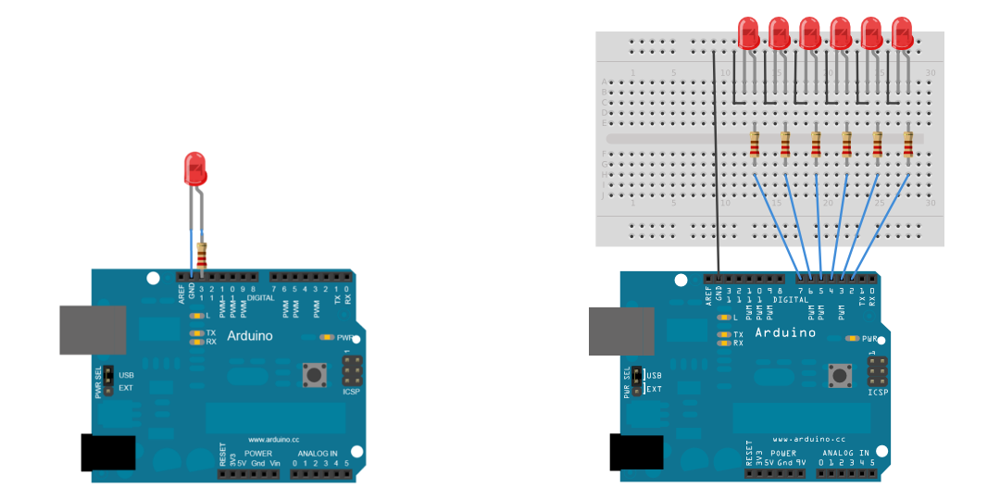

# Проект: Асинхронное управление светодиодами с использованием аппаратного таймера

В данном документе представлено решение задачи по организации независимого мигания пяти светодиодов с различными временными интервалами. Ключевая особенность проекта — использование аппаратных прерываний таймера вместо блокирующей функции `delay()`, что обеспечивает высокую эффективность и возможность расширения функционала программы.

## 1. Принцип работы и подход

### 1.1. Постановка задачи
Необходимо реализовать мигание пяти светодиодов, где каждый последующий светодиод имеет период мигания в N раз больше предыдущего. При этом основной цикл программы должен оставаться свободным для выполнения других потенциальных задач.

### 1.2. Выбранное решение
Для реализации был выбран подход, основанный на прерываниях от аппаратного таймера `Timer1`.

1.  **Настройка таймера:** `Timer1` конфигурируется для генерации прерывания с точным интервалом в **1 секунду**. Это достигается путем выбора режима CTC (Clear Timer on Compare Match), установки предделителя частоты и задания верхнего предела счета.
2.  **Обработчик прерывания (ISR):** Создана специальная функция `ISR(TIMER1_COMPA_vect)`, которая автоматически вызывается аппаратно каждую секунду.
3.  **Глобальный счетчик:** Внутри ISR инкрементируется глобальная `volatile` переменная `val`, которая фактически отсчитывает секунды с момента запуска микроконтроллера.
4.  **Управляющая логика:** В той же функции `my_digit_write()`, вызываемой из ISR, происходит проверка кратности текущего значения счетчика `val` заданным периодам для каждого светодиода. Если условие выполняется, состояние соответствующего пина инвертируется.

Такой подход позволяет полностью отделить логику управления светодиодами от основного потока программы, который остается незаблокированным в цикле `loop()`.

## 2. Аппаратная часть и схема подключения

**Компоненты:**
*   Плата Arduino Uno (или совместимая)
*   5 светодиодов
*   5 токоограничивающих резисторов номиналом 220 Ом
*   Макетная плата и соединительные провода

**Схема подключения:**
Светодиоды подключаются к цифровым пинам порта D (с D3 по D7) через резисторы.

*   `pinA` (Digital Pin 7) → Резистор → Анод светодиода 1
*   `pinB` (Digital Pin 6) → Резистор → Анод светодиода 2
*   `pinC` (Digital Pin 5) → Резистор → Анод светодиода 3
*   `pinD` (Digital Pin 4) → Резистор → Анод светодиода 4
*   `pinE` (Digital Pin 3) → Резистор → Анод светодиода 5
*   Катоды всех светодиодов объединены и подключены к выводу `GND` Arduino.



## 3. Программная реализация: анализ ключевых моментов кода

Рассмотрим наиболее важные участки кода, определяющие логику работы проекта.

```cpp
volatile unsigned int val = 0;
```
Объявление глобального счетчика с ключевым словом `volatile`. Это является обязательным требованием для переменных, которые изменяются внутри обработчика прерывания и используются в других частях программы. `volatile` информирует компилятор о том, что значение переменной может измениться в любой момент, предотвращая некорректные оптимизации.

---

```cpp
void setup() {
  cli(); // Временно отключаем прерывания для безопасной конфигурации
  
  // Настраиваем пины на выход через прямую запись в регистр
  DDRD = DDRD | (1 << pinA) | (1 << pinB) | (1 << pinC) | (1 << pinD) | (1 << pinE);

  // ...
  OCR1A = 62500; // Устанавливаем верхний предел счета
  TCCR1B |= (1 << WGM12) | (1 << CS12); // Режим CTC и предделитель 256
  TIMSK1 |= (1 << OCIE1A); // Разрешаем прерывание по совпадению
  
  sei(); // Включаем прерывания обратно
}
```
В функции `setup()` происходит вся начальная конфигурация.
*   **Прямая работа с регистрами:** Вместо многократного вызова `pinMode()` используется побитовая операция `OR` с регистром `DDRD`. Это более эффективный и быстрый способ настройки сразу нескольких пинов одного порта.
*   **Расчет значения для таймера:** При тактовой частоте 16 МГц и предделителе 256, таймер делает `16 000 000 / 256 = 62 500` тактов в секунду. Устанавливая `OCR1A = 62500`, мы заставляем таймер генерировать прерывание ровно раз в секунду.

---

```cpp
void my_digit_write() {
  val++;
  
  // ... вычисление логических флагов first, second и т.д. ...
  
  // Инвертирование состояния пинов с помощью побитового XOR
  PORTD = PORTD ^ (first << pinA);
  PORTD = PORTD ^ (second << pinB);
  // ... и для остальных пинов
}

ISR(TIMER1_COMPA_vect) {
  my_digit_write();
}
```
Это ядро всей логики.
*   `ISR(TIMER1_COMPA_vect)` — это объявление обработчика прерывания, который система вызывает автоматически при срабатывании таймера.
*   `val % (x * N) == 0` — простая и надежная проверка того, что прошло необходимое количество секунд для переключения конкретного светодиода.
*   `PORTD = PORTD ^ (mask)` — эффективный способ инвертировать состояние пина. Выражение `(first << pinA)` создает битовую маску (например, `0b10000000`), где единица стоит только в позиции нужного пина. Операция `XOR (^)` инвертирует соответствующий бит в регистре `PORTD`, не затрагивая остальные. Если флаг `first` равен `false`, маска будет нулевой, и `XOR` не произведет никаких изменений.

## 4. Результаты и демонстрация

### 4.1. Симуляция в Tinkercad

**Ссылка на проект:** [**https://www.tinkercad.com/**](https://www.tinkercad.com/)

### 4.2. Видео-демонстрация на реальном устройстве

