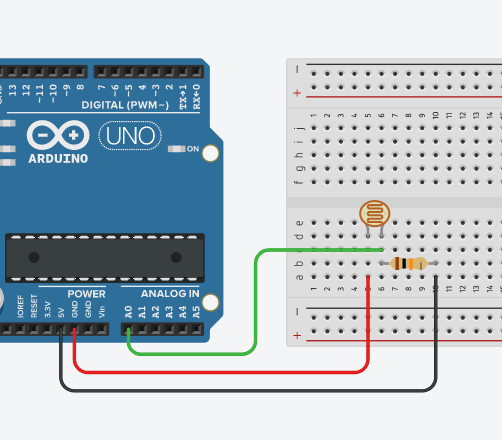
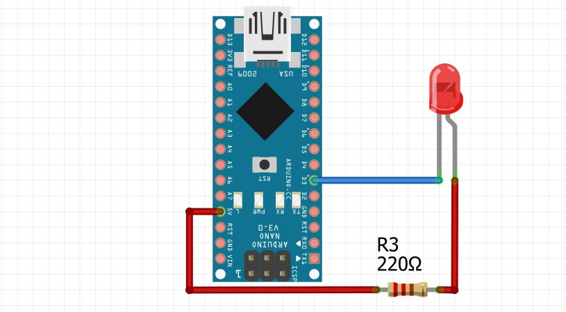

# Управление освещением с обменом данными по MQTT

**Цель**: Необходимо построить распределённую IoT-систему, в которой два микроконтроллера обмениваются данными с отдельными ПК по UART/Serial, а ПК взаимодействуют между собой через MQTT.

**Система включает**:
* Микроконтроллер-датчик (Sensor MCU) — считывает данные с фоторезистора и отвечает на команды запроса;
* Микроконтроллер-исполнитель (Actuator MCU) — управляет светодиодом (LED) на основе полученных команд;
* Python-скрипты — обеспечивают связь между ПК и микроконтроллерами через pyserial и взаимодействие между ПК через paho-mqtt;
* Монитор — независимый инструмент проверки корректности работы системы.

## Publisher



### Микроконтроллер
`pub.ino` выполняет функцию считывания значения с фоторизостора в двух режимах:
* `s` - потоковая
* `p` - одиночная

Далее происходит запись в `serial`:
```cpp
void sendSensorValue() {
  int sensorValue = analogRead(SENSOR_PIN);
  Serial.print("SENSOR_VALUE:"); 
  Serial.println(sensorValue);
}
```

### Скрипт Python
`pub.py` выполняет считывание из `serial` и отправляет значение на `MQTT`. В нашем случае используем открытый брокер `BROKER = "broker.emqx.io"`.

Для демострации работы двух режимов отправки `p` и `s` просто используем `random`: 
```python
send_type = random.choice(['p', 's', 'p', 'p'])
print(f"\nSending command: '{send_type}'")
```

В зависимости от считанного значения `value` делаем переключатель режимов:
```python
message_to_publish = ''
if value < 625:
    message_to_publish = 'u'
    print(f"Value u: {value}")
elif 625 <= value <= 800:
    message_to_publish = 'b'
    print(f"Value b: {value}")
else:
    message_to_publish = 'd'
    print(f"Value d: {value}")
```

### Демонстрация работы


## Subscriber


Эту часть делал [Миша](https://github.com/m513t20).

### Микроконтроллер
`sub.ino` выполняет функцию управления светодиодом на основе команд, полученных через `serial`:
* `u` - включает светодиод (состояние `HIGH`).
* `d` - выключает светодиод (состояние `LOW`).
* `b` - запускает режим мигания светодиода.

Далее в качестве подтверждения происходит запись в `serial`:
```cpp
void updateState() {
  if (Serial.available()>0)
  { 
     LED_state = Serial.read();
    if (LED_state == LED_ON) {
      Serial.println("LED_GOES_ON");
    } else if (LED_state == LED_OFF) {
      Serial.println("LED_GOES_OFF");
    } else if (LED_state == LED_BLINK) {
      Serial.println("LED_GOES_BLINK");
    }
  }
}
```

### Скрипт Python
`sub.py` выполняет функцию подписчика (`subscriber`) на `MQTT`. Он получает команды из топика `laboratory/greenhouse/backyard` и отправляет их в `serial` для управления светодиодом. Мы также используем открытый брокер `broker.emqx.io`.

Ключевая логика находится в функции `on_message`, которая срабатывает при получении нового сообщения в топике. Полученная команда (`u`, `b` или `d`) напрямую отправляется на микроконтроллер:
```python
def on_message(client: Client, userdata, message: MQTTMessage):
    data = str(message.payload.decode("utf-8"))
    if data == '':
        return
    topic = message.topic
    print(f"Received message {data} from topic {topic}")
    connection.write(data.encode('utf-8'))
    time.sleep(.1)
    print(connection.read_all().decode())
```
В основном блоке программы скрипт подключается к брокеру, подписывается на нужный топик и переходит в режим ожидания сообщений:
```
client.loop_start()
print(f"Subcribing to {luminosity_topic}")
client.subscribe(luminosity_topic, qos=0)
time.sleep(3600)
client.disconnect()
client.loop_stop()
```

### Демонстрация работы

