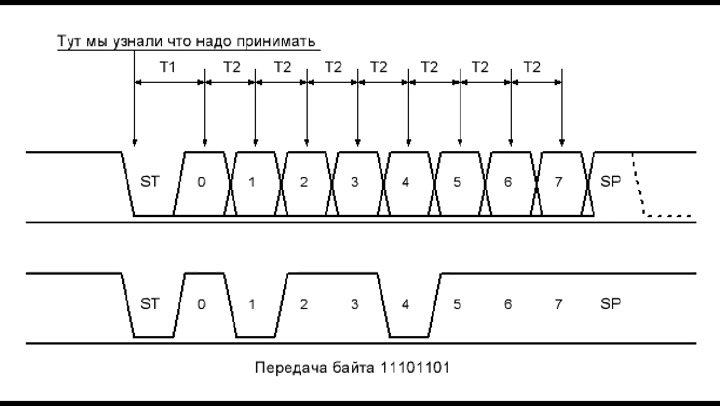

# Проект: Реализация асинхронной последовательной передачи данных (UART) 

## Задача 1: TX - передача

**Гипотеза решения:** ​Данные для отправки помещаются в программный буфер (по байтам). Передатчик делит байты на биты и при каждом срабатывании таймера изменяет состояние вывода TX в соответствии со следующим битом. Таймер задаёт точную длительность бита. Поддерживаются стартовый и стоповый биты (формат 8N1).

### Программная реализация: анализ ключевых моментов кода
```cpp
#define F_CPU 16000000UL

// Настройка портов
#define TX_PORT PORTD
#define TX_DDR DDRD
#define TX_PIN PD3

// Размер буфера
#define TX_BUFFER_SIZE 64

// Для работы с буферо и отправленным байтом
volatile char tx_buffer[TX_BUFFER_SIZE];
volatile uint8_t tx_tail = 0;
volatile uint8_t tx_head = 0;
volatile uint8_t tx_byte_to_send;
volatile uint8_t tx_bit_index;

volatile uint16_t timer_ticks_per_bit;
```
Объявление основных переменных и констант.


```cpp
void uart_init(uint16_t baud_rate) {
  const uint8_t prescaler = 8;
  timer_ticks_per_bit = (F_CPU / prescaler) / baud_rate;

  TX_DDR = TX_DDR | (1 << TX_PIN);
  TX_PORT = TX_PORT | (1 << TX_PIN); // по дефолту устанавливаем HIGH-сигнал на пин

  TCCR1A = 0;
  TCCR1B = 0;
  TCNT1 = 0;
  OCR1A = timer_ticks_per_bit; // настраиваем сравнение для прерывания по времени
  TCCR1B = TCCR1B | (1 << WGM12);
  TCCR1B = TCCR1B | (1 << CS11); // для prescaler=8

  sei();
}
```
В функции `void uart_init(uint16_t baud_rate)` происходит вся начальная конфигурация. Настраиваем здесь порт отдачи сигнала(по дефолту ставим `HIGH` на пин), 16-битный таймер `Timer 1` и сравнение `OCR1A` для прерывания.



```cpp
void uart_send(char b) {
  uint8_t next_head = (tx_head + 1) % TX_BUFFER_SIZE;

  while (next_head == tx_tail) {}

  tx_buffer[tx_head] = b;
  tx_head = next_head;

  cli();
  // если прерывание для отправки битов выключено
  if ((TIMSK1 & (1 << OCIE1A)) == 0) {
    tx_byte_to_send = tx_buffer[tx_tail];
    tx_tail = (tx_tail + 1) % TX_BUFFER_SIZE;
    tx_bit_index = 0;
    TCNT1 = 0; // обнуление таймера
    TIMSK1 = TIMSK1 | (1 << OCIE1A); // включить прерывание 
  }
  sei();
}
```
Функция `void uart_send(char b)` отвечает за логику отправки одного байта(символа). Здесь реализована идея кольцевого буфера - из буфера записываем в глобальную переменную `tx_byte_to_send` помещаем байт на отправку и сдвигаем индексы `tx_tail` и `tx_head`.

```cpp
void uart_send_string(const char *msg) {
  while (*msg) {
    uart_send(*msg++);
  }
}
```
Функция `void uart_send_string(const char *msg)` отправляет полное сообщение, используя цикл и реализованную функцию отправки одного байта `void uart_send(char b)`.

```cpp
ISR(TIMER1_COMPA_vect) {
  switch (tx_bit_index) {
    case 0:
      TX_PORT = TX_PORT & ~(1 << TX_PIN);
      break;
    case 1:
    ...
    ...
    case 8:
      if (tx_byte_to_send & 1) {
        TX_PORT = TX_PORT | (1 << TX_PIN); // HIGH-сигнал
      } else {
        TX_PORT = TX_PORT & ~(1 << TX_PIN); // LOW-сигнал
      }
      tx_byte_to_send = tx_byte_to_send >> 1;
      break;
    case 9:
      TX_PORT = TX_PORT | (1 << TX_PIN);
      break;
    default:
      if (tx_head != tx_tail) {
        tx_byte_to_send = tx_buffer[tx_tail];
        tx_tail = (tx_tail + 1) % TX_BUFFER_SIZE;
        tx_bit_index = 0;
        return;
      } else {
        TIMSK1 = TIMSK1 & ~(1 << OCIE1A);
      }
      break;
  }
  tx_bit_index++;
}
```
`ISR(TIMER1_COMPA_tx_bit_indexvect)` - прерывание по сравнению. Проверяет текущий `tx_bit_index`: 
1. При значении 0 устанавливаем `LOW` сигнал в `TX_PORT`, тем самым обозначая передачу байта
2. При значении от 1-8 передаем `HIGH` и `LOW` сигнал в соответствии с 1 и 0.
3. При значении 9 передаём `HIGH` сигнал, тем самым обозначая конец передачи байта.
4. `default` - повторение отправки если `tx_head != tx_tail`(значит есть, что отправлять), а иначе отключаем прерывание.
```cpp
void setup() {
  uart_init(9600);
}


void loop() {
  uart_send_string("Hello World! 12345\r\n");

  for (volatile uint64_t i = 0; i < 200000; ++i) {} //вместо delay 
}
```

Настройка собственного `TX` и тестирование с искусственной задержкой.

### Видео-демонстрация на реальном устройстве


## Задача 2: RX - приёмник

**Гипотеза решения:** ​Обнаружение начала передачи (переход HIGH → LOW) выполняется с помощью внешнего аппаратного прерывания. После обнаружения старта тот же аппаратный таймер используется для выборки входного сигнала в середине каждого бита, чтобы восстановить байт данных.

### Программная реализация: анализ ключевых моментов кода
```cpp
#define F_CPU 16000000UL

#define RX_PORT PORTD
#define RX_DDR DDRD
#define RX_PIN PD2
#define RX_PIN_REG  PIND

#define RX_BUFFER_SIZE 64


volatile char rx_buffer[RX_BUFFER_SIZE];
volatile uint8_t rx_head = 0;
volatile uint8_t rx_tail = 0;
volatile uint8_t rx_byte_received;
volatile uint8_t rx_bit_index;

volatile uint16_t timer_ticks_per_bit;
```
Объявление основных переменных и констант.

```cpp
void uart_init(long baud_rate) {
  const uint8_t prescaler = 8;
  timer_ticks_per_bit = (F_CPU / prescaler) / baud_rate;

  RX_DDR = RX_DDR & ~(1 << RX_PIN);
  RX_PORT = RX_PORT | (1 << RX_PIN);

  // настройка внешнего прерывания INT0 - реагирование на падение HIGH->LOW
  EICRA = EICRA | (1 << ISC01);
  EICRA = EICRA & ~(1 << ISC00);
  EIMSK = EIMSK | (1 << INT0);

  TCCR1A = 0;
  TCCR1B = 0;

  TCCR1B = TCCR1B | (1 << WGM12);
  TCCR1B = TCCR1B | (1 << CS11); // для prescaler=8

  sei();
}
```
В функции `uart_init(long baud_rate)` происходит вся начальная конфигурация. Настраиваем здесь порт приёма сигнала, 16-битный таймер `Timer 1`.
```cpp
uint8_t uart_available() {
  return (rx_head - rx_tail + RX_BUFFER_SIZE) % RX_BUFFER_SIZE;
}
```
`uint8_t uart_available()` проверяет - есть ли что на вход.

```cpp
char uart_read() {
  if (rx_head == rx_tail) {
    return -1;
  }
  char b = rx_buffer[rx_tail];
  rx_tail = (rx_tail + 1) % RX_BUFFER_SIZE;
  return b;
}
```
В функции `char uart_read()` получаем символ из буфера.

```cpp
// случилось прерывание - с LOW -> HIGH
ISR(INT0_vect) {
    EIMSK = EIMSK & ~(1 << INT0); // отключаем это прерывание 
    
    TCNT1 = 0; // сбрасываем таймер 
    OCR1B = timer_ticks_per_bit + (timer_ticks_per_bit / 2); // сравнение устанавливаем на 1.5*Tbit

    rx_bit_index = 0;
    rx_byte_received = 0;

    TIMSK1 = TIMSK1 | (1 << OCIE1B); // включаем прервание по совпадению таймера
}
```
Настраиваем прерывание на смену сигнала с `LOW->HIGH`:
1. Отключение: Первым делом он отключает сам себя, чтобы избежать повторных срабатываний от возможных помех на линии.
2. Нацеливание таймера: Это самый важный момент для синхронизации. `INT0` сработал в начале старт-бита. Нам нужно считать первый бит данных (D0) точно в его середине. D0 начнется через `1 * Tbit` и его середина будет еще через `0.5 * Tbit`. Итого, первая проверка должна произойти через `1.5 * Tbit`. Мы сбрасываем счетчик `TCNT1` и устанавливаем регистр сравнения `OCR1B` именно на это значение.
3. Сброс состояния: Готовим переменные для приема нового байта.
4. Включаем прерывание по совпадению `TIMER1_COMPB_vect`. Теперь таймер начнет отсчет до значения в `OCR1B`.

```cpp
// прерывание на сраванение
ISR(TIMER1_COMPB_vect) {
    OCR1B += timer_ticks_per_bit; // настравиваем следующее прерывание

    if (rx_bit_index < 8) { // считываем 8 бит данных
        rx_byte_received = rx_byte_received >> 1;
        if (RX_PIN_REG & (1 << RX_PIN)) {
            rx_byte_received = rx_byte_received | 0x80; // устанавливаем в верном порядке биты.
        }
    } else { // это стоп-бит
        uint8_t next_head = (rx_head + 1) % RX_BUFFER_SIZE;
        if (next_head != rx_tail) {
            rx_buffer[rx_head] = rx_byte_received;
            rx_head = next_head;
        }

        TIMSK1 = TIMSK1 & ~(1 << OCIE1B); // выключаем прервание по времени
        EIMSK = EIMSK | (1 << INT0); // включаем прервание на передачу в порт
    }
    rx_bit_index++;
}
```
Настройка прерывния по сравнению:
1. Планирование: Первым делом, сразу после входа, мы увеличиваем `OCR1B` на `timer_ticks_per_bit`. Это гарантирует, что следующее прерывание произойдет ровно через один битовый интервал.
2. Сборка байта: Если мы еще не приняли 8 бит, мы выполняем:
   * `rx_byte_received >>= 1;`: Сдвигаем уже собранные биты вправо.
   * `if (RX_PIN_REG & ...)`: Проверяем состояние пина.
   * `rx_byte_received |= 0x80;`: Если на пине `HIGH`, мы устанавливаем в 1 самый старший бит приемного байта. Так как биты приходят младшим вперед (LSB first), мы собираем байт как бы "задом наперед", и после 8 таких операций он оказывается в правильном порядке.
3. Стоп-бит: На 9-е срабатывание (когда `rx_bit_index` равен 8), мы знаем, что это время стоп-бита. Мы используем этот момент, чтобы сохранить полностью собранный байт в кольцевой буфер.
4. Процесс приема одного байта завершен. `TIMER1_COMPB_vect` выключает сам себя, а  `INT0_vect` снова активируется, готовый ловить следующий стартовый бит.

Система возвращается в исходное состояние ожидания.

```cpp
void setup() {
  uart_init(9600);
  
  //Для теста
  Serial.begin(9600);
}

void loop() {
  if (uart_available()) {
    char c = uart_read();

    Serial.print(c);
  }
}
```
Настройка собственного `RX` и тестирование.
